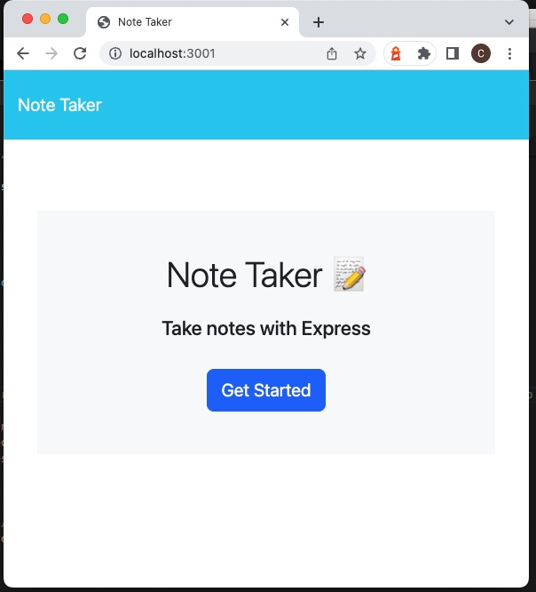
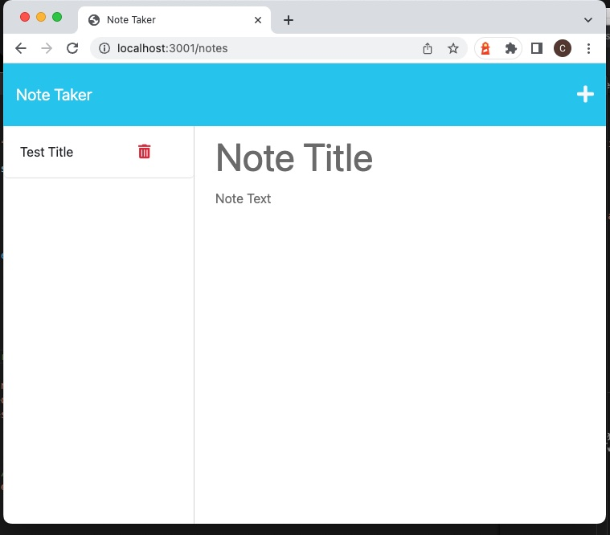
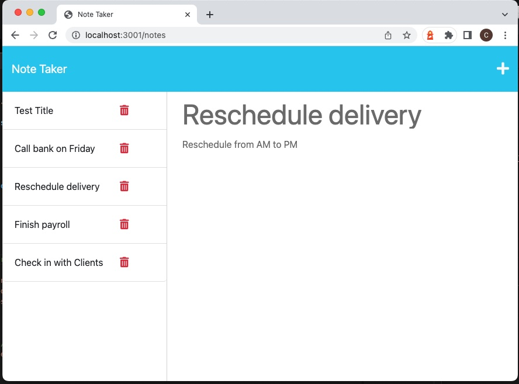
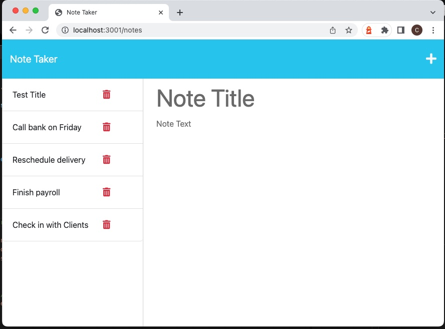

# Express.js Note Taker

Link to Heroku Deployed site: [https://](https://)

## Description

This is an appication called Note Taker then can be used to write and save notes. The purpose of the app is so users can keep track of their notes to-do list. As each new note is added, the note is saved in the server. When the user wishes to review a previous note's details, they can do so by selecting that note's title from the side bar.

## Installation

This application uses Express.js back end and will save retreive note data from a JSON file. It also uses http://localhost:3001/ as the port for the server. The application is deployed using Heroku.

## Preview & Usage

1. Visit http://localhost:3001/ which takes you to the main page; click on 'get started' to continue.
2. The next page presented is the Note Taker usage area. 
3. When you add a new note title and correponding text, a saved icon will appear; clicking on it will save the note (and the note should appear on the left side bar). This is achieved using the POST request fetch method on the backend.
4. Next time you open the Note Taker, it will display all the previous saved notes using the GET request fetch method. 
5. Future application is to feature a delete function - where you can delete existing notes using DELETE request method.

## License

There were no licenses obtained for this project. For more information on licenses, follow this link:
[https://choosealicense.com/](https://choosealicense.com/).